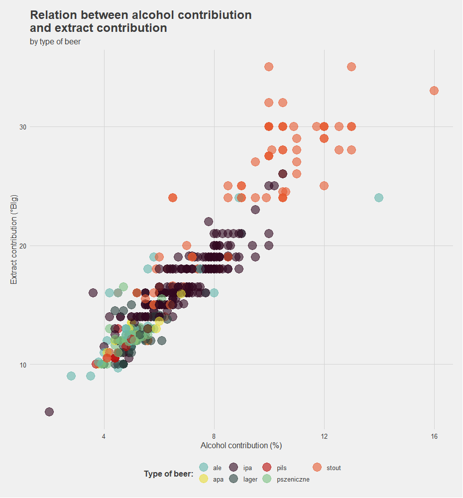
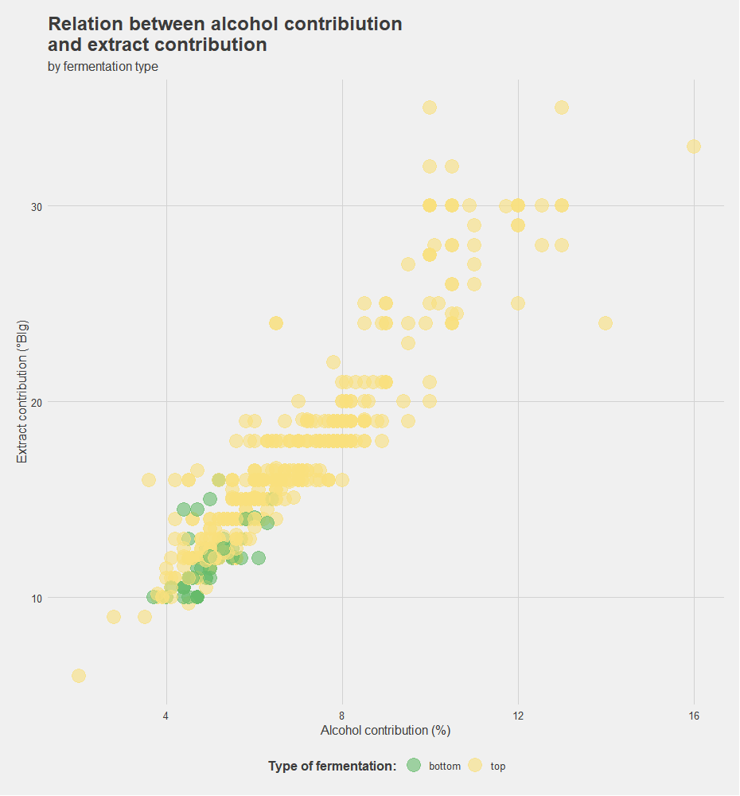
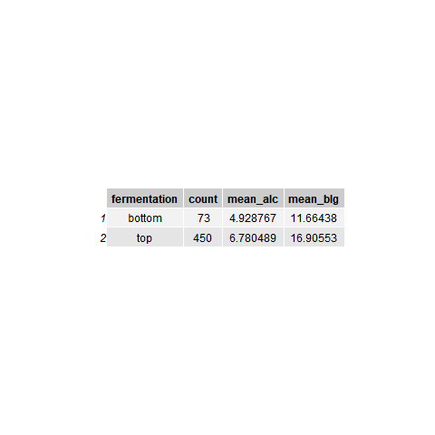
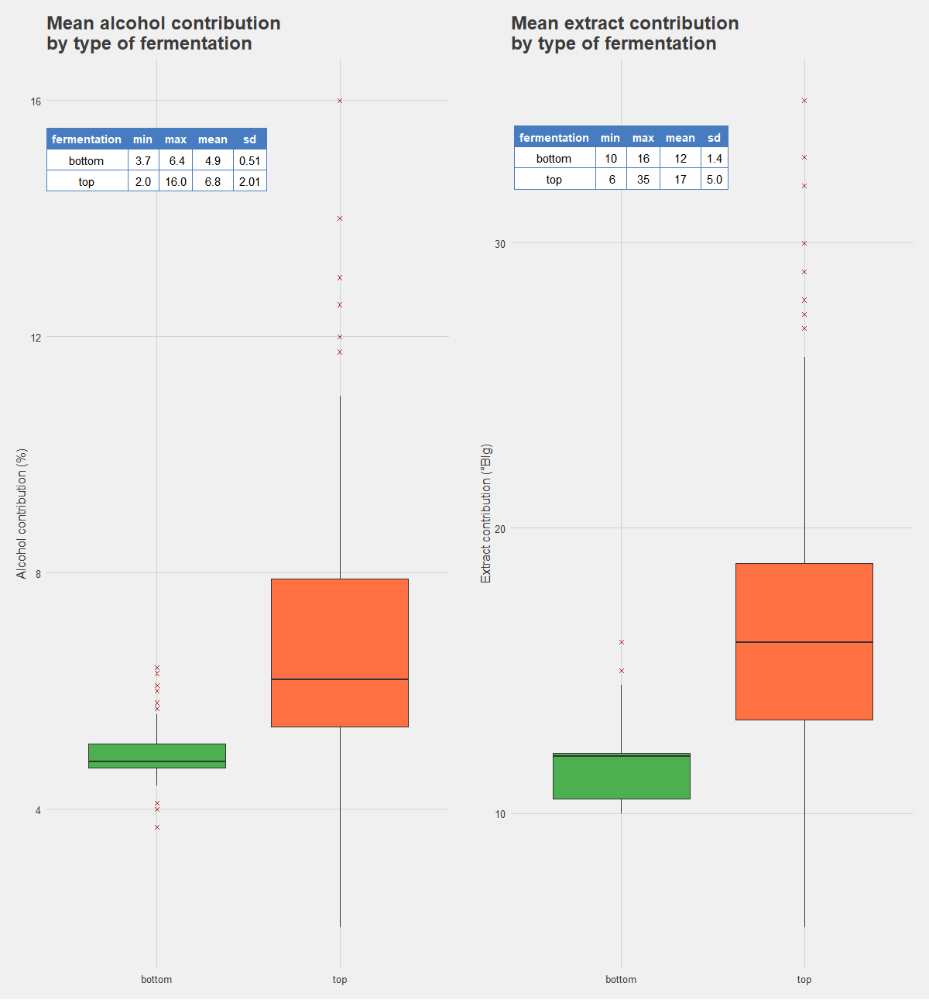
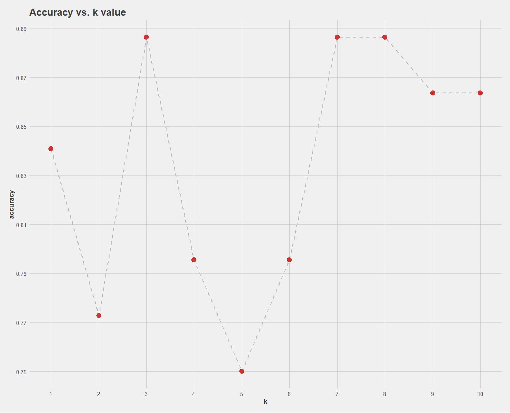
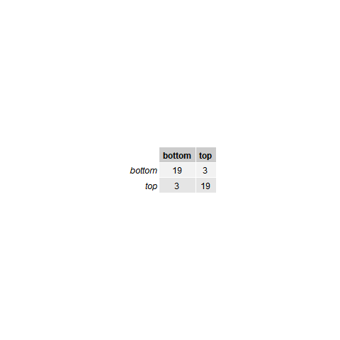

<style type="text/css">
  body{
  font-size: 14pt;
}
</style>


```{r setup, include=FALSE}
knitr::opts_chunk$set(echo = TRUE)
```

# **About the project**

Main goal of this project is to collect data about beers from polish shop website www.ipiwo.pl.
Data from this website is accquired with use of web scraping package called **rvest**.
After scraping pages, data needs a lot of cleaning. Lastly, obtained data is analysed, main part of analysis is dedicatied to knn model.

For easier navigation, this project is divided into three parts - each part has dedicated R script file:

* Obtaining data - **Beer-get-data.R**
* Data cleaning - **data-cleaning.R**
* Data analysis - **data-analysis.R**

## **Obtaining data**

As mentioned before, data is collected by using **rvest** package, which makes extracting particular html tags very easy. To find interesting tag, extension for google Chrome - **SelectorGadget** was used. This extension display name of node that you are hovering over, later name of the node is used in **rvest** functions to extract informations.

Whith use of this technique it was possible to create dataset containing all products from this website in rather short time (there were more than 900 products). Collected data contained information about: *product name*, *brewery*, *type of beer*, *alcohol contribution*, *extract contribution*, *price* and even *description*. There were plenty of missing values due to inconsistent structure of details of products. Some of these information will not be used in further analysis, but it is convinient to have them forfuture expansion of this project.

This part creates dataset with a lot of nulls and badly formated values, co a lot of cleaning is needed.

## **Data cleaning**

Some data cleaning steps were preprocessed when collecting data, but dataset still needed some correction.
Putting aside converting data types of each variable and cleaning strings, one major step was to create new categorical variable, that will have information about simplified beer type (becouse on the website there were diffrent styles of particular types, e.g. *west coast IPA* and *new england IPA* were different categories. To simplify structure of data, we will treat them as same type, so both of mentioned will be tagged as just *IPA*). As we dont need every type of beer for further analysis, new variable will be divided into 7 categories: *IPA*, *APA*, *Ale*, *Stout*, *Lager*, *Pils* and *Pszeniczne* (Wheat beer). Obsevrations are assigned to each category by extracting particular pattern from *type* variable. Observations that have no assigned category are omitted so this operation shorten dataset to 523 observations.

Another important step processed in *data-cleaning* script is creating new variable that have information about fermentation type of each product. This information was not avaliable on the page, but it can be figured out based on beer type. More precisely, each of category of beer has it distct type of fermenation:
* Lagers and Pils are beers that are processed with bottom fermentation,
* IPAs, APAs, Ales, Stouts, and Pszeniczne are top fermentation beers.
Knowing that, we can easily assign fermentation type to each observation. This variable will be our main point of intrest becouse knn classification model will classify fermentation type based on alcohol and extract contribution.

This part create output of clean dataset with each variable type properly assigned.

## **Data analysis**

This part is sctrictly deticated to data visualization and creating knn model. Visualization emphasizes diffirences between beer types and fermentation types when it comes to alcohol and extract contribution.

### **Data visualization**

Firstly, scatter plot for relation between alcohol and extract contribution with division between all beer types will be created. As it is visible from the graph below, relation between alcohol and extract contribution is nearly linear. It is not extraordinary, because the more extract in the wort, the more alcohol will be in the final product. We can see that types of beer create some clusters, so we can assume that differences in all beers types are very distinct, e.g. Stouts are very strong beers, while ales are rather light.





To simplify graph mentioned above, we can create scatter plot for the same variables, but grouping observations by fermentation type. This graph is more interesting from the point of this analysis. Is shows that bottom and top fermentations are very different. Beeres processed with bottom fermenation are those light ones. 





To emphesize differences between these two processes, simple summary table can be created. As visible below, mean contribution of alcohol in bottom fermented beers is a bit lower than in top ones - same for extract contribution.
This summary shows also one other thing - disproportion between size of groups - this can be essential in classification.





And to visualize these differences, baxplots can be displayed:





### **KNN classification**

Once we know that those two processes are different in characteristic of final products, we can create knn classification model.

First step was to make subset of data, that will be more balanced as far as size of both groups is concerned. To achieve that random sample of 73 observations with top fermentation were selected.

After that, data was splited into two groups: training set and test set.
Size of training set was 102 observations while test set has 44 observations.

Creation of knn classifiation model demands selecting value of *k* parameter. Usually it is square root of size of sample, but we can find optimal value of *k* by comparing accuracy of models created based on differnet *k* value - from *k*=1 to *k*=10.

We can plot values of *k* and accuracy for them:





As it can be seen on the graph above, the greatest accuracy knn model achieve for *k* equals 3 and 7. So for final model we will chose that with *k*=3. Let's create confusion matrix:





As we can see, knn model is pretty accurate, there are only 3 false positive classifications, and 3 true negative.
Accuracy of this model is 86.63%.


### **Summary**

To sum up, all goals of this project have been achieved - from obtaining data to creating classification model that has great predictive ability. For sure, this project could be extended, for example - features from descriptions of products could be used as another variable, but this is issue for another paper.


